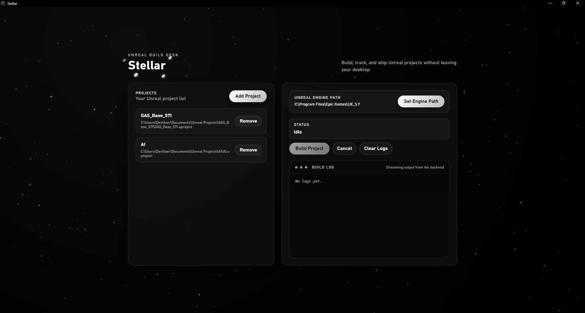

# Stellar

Native desktop utility for managing and building Unreal Engine projects.



## Features

- Auto-detect Unreal Engine installations
- Manage multiple UE projects
- Build projects with visual progress and log output
- Remembers engine selection and project list between sessions

## Tech Stack

Tauri 2 desktop app with React + TypeScript frontend and Rust backend.

## Requirements

- Windows 10/11
- Unreal Engine 5.x installed

## Installation

Download the latest release (`Stellar_x.x.x_x64-setup.exe`) and run the installer.

## Development

### Prerequisites

- Node.js 18+
- Rust toolchain
- npm

### Setup

```bash
npm install
```

### Run in development

```bash
npm run dev:tauri
```

### Build for production

```bash
npm run build:tauri
```

The installer will be created at `src-tauri/target/release/bundle/nsis/`.

## Project Structure

```
Stellar/
├── frontend/          # React + TypeScript UI
├── shared/            # Shared types
└── src-tauri/         # Tauri app (Rust backend)
```

## Architecture

- Frontend uses React + TypeScript running in Tauri's WebView
- Backend logic (config, engine detection, builds) is implemented as Rust Tauri commands
- Frontend calls Rust via `invoke()` - no HTTP, no separate process
- Config is persisted to the user's app data directory

## License

MIT
